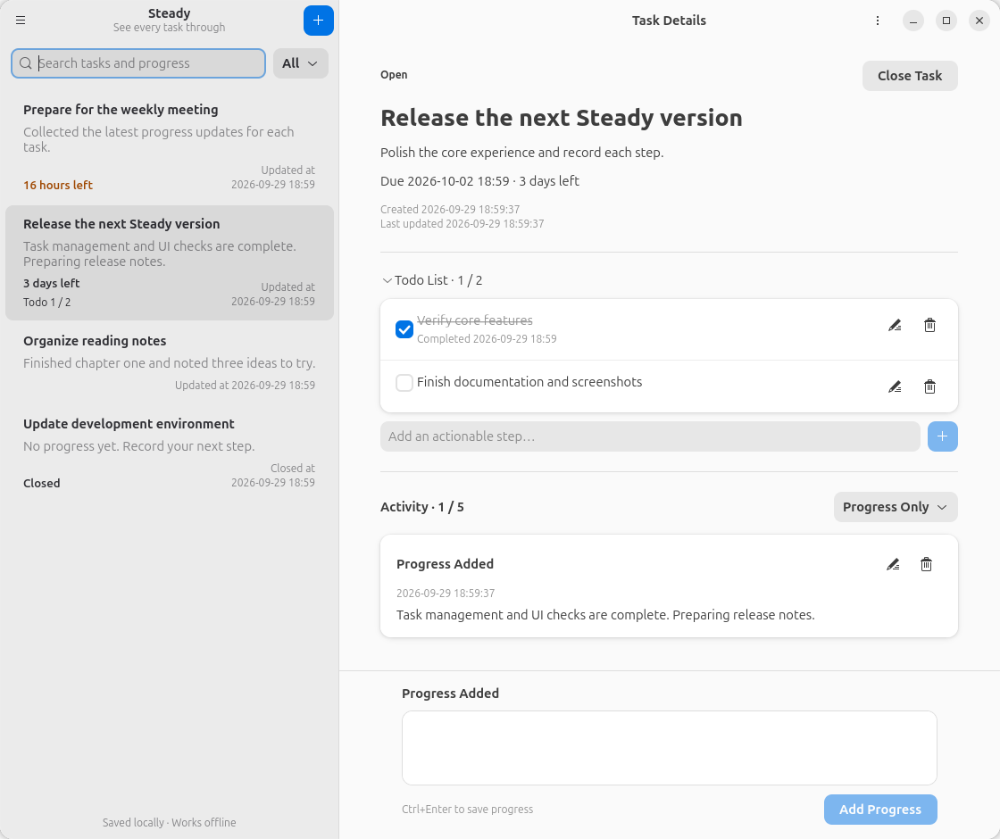

# Steady

[简体中文](README.md) | **English**


## Overview

Steady is a native GNOME task manager built with GTK 4 and libadwaita. Keep track of every step, from starting a task and recording progress to closing it out.



- Create, edit, and delete tasks, and record and manage timestamped progress updates.
- Add optional deadlines and Todo checklists, with countdowns and items you can check or uncheck.
- Filter by task status, keywords, and activity type, and reopen closed tasks.
- Keep your data locally with no account required, automatic draft saving, and JSON backup and restore.
- Use Simplified Chinese, Traditional Chinese, English, German, French, Russian, Spanish, or Japanese. The interface follows your system by default; select **Language…** in the main menu and restart to change it.

## Build and Run

Requires Python ≥ 3.10, PyGObject, GTK ≥ 4.12, and libadwaita ≥ 1.5.

Install the runtime dependencies on Ubuntu / Debian (your distribution must provide versions that meet these requirements):

```bash
sudo apt install python3-gi gir1.2-gtk-4.0 gir1.2-adw-1
```

Run directly from the project directory, without compiling:

```bash
./run
```

Install for the current user and add the app to the application menu:

```bash
/usr/bin/python3 tools/install.py
```

After installation, search for **Steady** in the application menu. Quit the app normally before updating; the installer preserves existing data and migrates legacy directories.

Alternatively, build and install with Meson. This also requires Meson, Ninja, pkg-config, and the GTK / libadwaita development packages:

```bash
meson setup build --prefix="$HOME/.local"
meson install -C build
```
