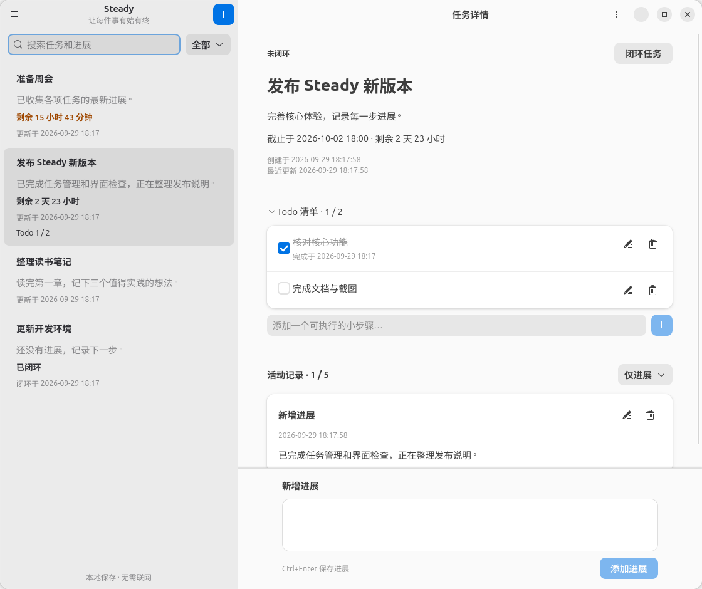

# Steady

**简体中文** | [English](README.en.md)


## 概述

Steady 是一款基于 GTK 4 和 libadwaita 的 GNOME 原生任务管理应用，记录任务从开始、推进到闭环的每一步。



- 创建、编辑、删除任务，随时记录和管理带时间的进展。
- 可选截止时间与 Todo 清单，支持倒计时、勾选和取消勾选。
- 按任务状态、关键词和活动类型筛选，已闭环任务可重新打开。
- 数据保存在本地，无需账号，支持草稿保存和 JSON 备份恢复。

## 构建和运行

需要 Python ≥ 3.10、PyGObject、GTK ≥ 4.12 和 libadwaita ≥ 1.5。

Ubuntu / Debian 安装运行依赖（发行版提供的版本需满足上述要求）：

```bash
sudo apt install python3-gi gir1.2-gtk-4.0 gir1.2-adw-1
```

在项目目录直接运行，无需编译：

```bash
./run
```

安装到当前用户的应用菜单：

```bash
/usr/bin/python3 tools/install.py
```

安装后在应用菜单搜索 **Steady**。更新前请正常关闭应用；安装脚本会保留现有数据并迁移旧版目录。

也可使用 Meson 构建安装，需额外安装 Meson、Ninja、pkg-config 及 GTK / libadwaita 开发包：

```bash
meson setup build --prefix="$HOME/.local"
meson install -C build
```
